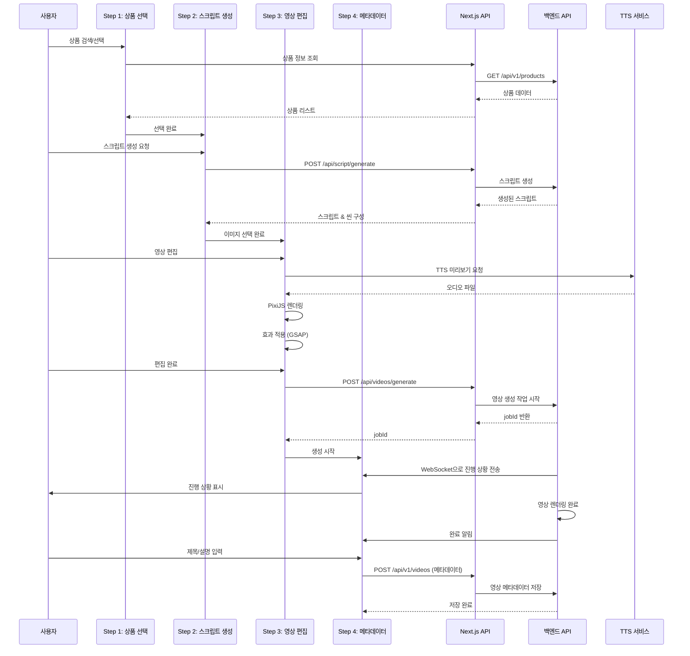
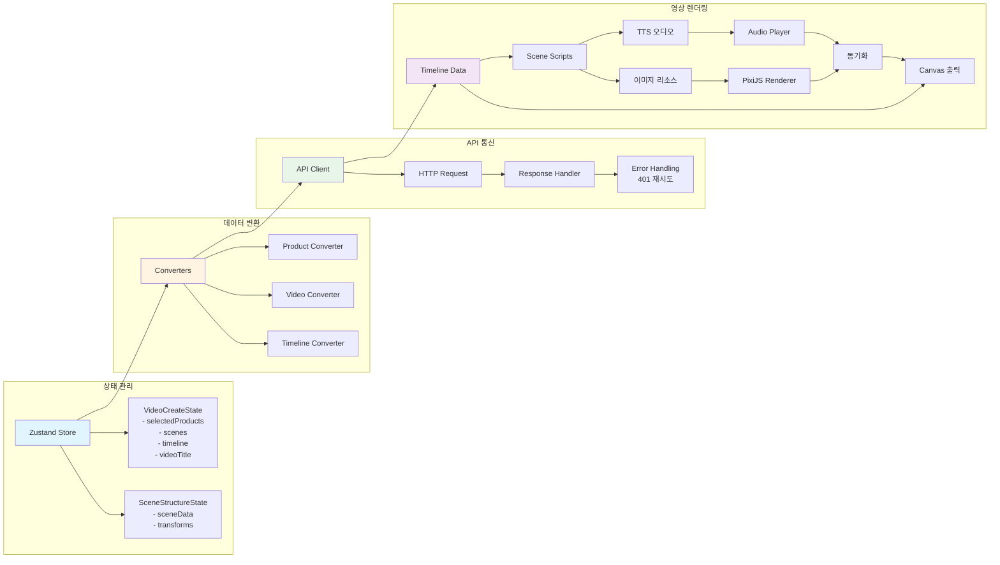
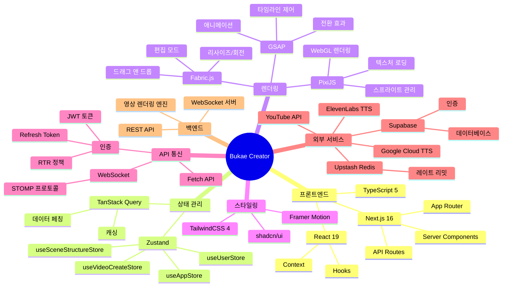

# Bukae Creator 아키텍처 다이어그램

## 전체 시스템 아키텍처

```mermaid
graph TB
    subgraph "클라이언트 (브라우저)"
        UI[사용자 인터페이스]
        UI --> Step1[Step 1: 상품 선택]
        UI --> Step2[Step 2: 스크립트 생성]
        UI --> Step3[Step 3: 영상 편집]
        UI --> Step4[Step 4: 메타데이터 설정]
        
        Step1 --> Store1[Zustand Store<br/>useVideoCreateStore]
        Step2 --> Store1
        Step3 --> Store1
        Step4 --> Store1
        
        Step3 --> Store2[useSceneStructureStore]
        Step3 --> Store3[useAppStore]
        Step3 --> Store4[useUserStore]
        
        Step3 --> Hooks[Custom Hooks]
        Hooks --> Playback[재생 훅<br/>useFullPlayback<br/>useTimelinePlayer]
        Hooks --> Scene[씬 관리 훅<br/>useSceneManager<br/>useSceneHandlers]
        Hooks --> Editing[편집 훅<br/>usePixiEditor<br/>useFabricHandlers]
        Hooks --> TTS_Hook[TTS 훅<br/>useTtsManager<br/>useTtsPreview]
        Hooks --> Effects[효과 훅<br/>usePixiEffects<br/>전환 효과]
        
        Step3 --> RenderEngine[렌더링 엔진]
        RenderEngine --> PixiJS[PixiJS<br/>재생/렌더링]
        RenderEngine --> FabricJS[Fabric.js<br/>편집 모드]
        RenderEngine --> GSAP[GSAP<br/>애니메이션]
        
        Step3 --> API_Client[API 클라이언트]
        API_Client --> Auth[인증 관리<br/>auth-storage.ts]
        API_Client --> RateLimit[레이트 리밋<br/>rate-limit.ts]
    end
    
    subgraph "Next.js 서버 (프론트엔드)"
        NextAPI[API Routes]
        NextAPI --> AuthAPI[/api/auth/refresh<br/>/api/auth/oauth-callback]
        NextAPI --> TTSAPI[/api/tts/synthesize<br/>/api/tts/voices]
        NextAPI --> VideoAPI[/api/videos/generate]
        NextAPI --> ScriptAPI[/api/script/generate]
        NextAPI --> ImageAPI[/api/images/upload]
        NextAPI --> MediaAPI[/api/media/proxy<br/>/api/media/upload]
        
        NextAPI --> RateLimitCheck[Upstash Redis<br/>레이트 리밋 체크]
    end
    
    subgraph "백엔드 API 서버"
        Backend[백엔드 API]
        Backend --> StudioJobs[/api/v1/studio/jobs<br/>영상 생성 작업]
        Backend --> AuthBackend[/api/v1/auth/refresh<br/>인증]
        Backend --> ProductsAPI[/api/v1/products<br/>상품 정보]
        Backend --> VideosAPI[/api/v1/videos<br/>영상 메타데이터]
        Backend --> StatsAPI[/api/v1/statistics<br/>통계]
        
        Backend --> WS[WebSocket 서버<br/>STOMP 프로토콜<br/>실시간 상태 업데이트]
    end
    
    subgraph "외부 서비스"
        GoogleTTS[Google Cloud TTS<br/>음성 합성]
        ElevenLabs[ElevenLabs TTS<br/>프리미엄 음성]
        SupabaseDB[(Supabase<br/>인증 & 데이터베이스)]
        Redis[(Upstash Redis<br/>레이트 리밋)]
        YouTube[YouTube API<br/>업로드]
    end
    
    API_Client --> NextAPI
    NextAPI --> Backend
    NextAPI --> GoogleTTS
    NextAPI --> ElevenLabs
    NextAPI --> SupabaseDB
    NextAPI --> Redis
    
    Backend --> GoogleTTS
    Backend --> SupabaseDB
    Backend --> YouTube
    
    API_Client --> WS
    WS --> Step4
    
    style UI fill:#e1f5ff
    style Store1 fill:#fff4e1
    style RenderEngine fill:#e8f5e9
    style NextAPI fill:#f3e5f5
    style Backend fill:#fce4ec
    style GoogleTTS fill:#fff9c4
    style SupabaseDB fill:#e0f2f1
```


## 당장 필요한 것 (우선순위 기반)

> 목표: Step 3(미리보기 및 편집)을 **진짜 영상 편집기처럼** 동작하게 만들고(정확한 seek/pause/resume), 향후 **사용자 비디오 편집 기능**을 무리 없이 수용한다.

### P0. 타임라인/재생(Transport) 엔진 재설계 (즉시)

현재 Step 3의 가장 큰 리스크는 "타임라인 시간"이 편집기 전체에서 단일 의미로 동작하지 않는다는 점이다.
특히 TTS가 여러 파일(세그먼트)로 분리되어 있을 때, seek/pause/resume가 파일 경계에 끌려가거나 상태가 점프하는 문제가 발생한다.

**즉시 도입해야 하는 원칙**
- **단일 타임라인 시간 `t`(seconds)** 를 편집기 전체의 유일한 기준으로 고정한다.
- **오디오를 마스터 클럭으로** 삼아(권장: Web Audio API), 렌더링(Pixi/Canvas)과 UI 플레이헤드는 항상 `t`를 기준으로 동기화한다.
- 재생/일시정지/이동(seek)은 "오디오 파일 단위"가 아니라 **타임라인 단위**로 동작해야 한다.

**적용 체크리스트**
- [ ] `Transport`(또는 `PlaybackEngine`) 모듈 도입
  - 상태: `isPlaying`, `timelineOffsetSec`, `audioCtxStartSec`(재생 시작 기준), `playbackRate`
  - 함수: `play()`, `pause()`, `seek(sec)`, `setRate(rate)`, `getTime()`
- [ ] TTS를 "여러 파일"이 아닌 **연속 트랙(세그먼트 테이블)** 로 모델링
  - 각 세그먼트: `{ url, startSecOnTimeline, durationSec, textRange?, sceneId }`
  - 재생 시점 `t`에서 해당 세그먼트를 찾아 `offset = t - startSecOnTimeline`으로 정확히 시작
- [ ] pause 시 **현재 t를 저장**하고, 오디오/효과를 정지하되 "종료 지점"으로 이동하지 않도록 상태 머신으로 보장
- [ ] 프리뷰 렌더는 `renderAt(t)` 형태로 구성하여 (동일 t → 동일 결과) 결정성을 확보

### P0. 디버깅/QAQC 도구(편집기급 기능) 최소 세트

편집기 QA/QC에서 요구하는 것은 "보이는 대로"가 아니라 "정확히 맞는지"를 확인할 수 있는 도구다.

- [ ] 프레임/시간 단위 플레이헤드 표시(초 + ms)
- [ ] 1프레임 step(±1f), 0.1초 step(±0.1s) 단축키
- [ ] 현재 활성 오디오 세그먼트(파일)와 오프셋 표시
- [ ] 씬별 시작/종료, 전환 시작/종료, 자막 등장 타이밍 마커 표시
- [ ] (가능하면) 오디오 파형 표시 및 마커 스냅

### P1. 프리뷰와 서버 렌더 결과 차이 축소를 위한 "단일 스펙" 도입

현재는 프리뷰(클라이언트 합성 렌더)와 서버 렌더(내보내기)가 서로 다른 구현/해석을 가지기 쉬워, JSON을 조정해도 차이를 완전히 제거하기 어렵다.
비디오 편집이 추가되면 이 차이는 더 커진다.

- [ ] `Composition Spec`(단일 컴포지션 스펙) v1 정의
  - 트랙: video/image/text/subtitle/tts/sfx/bgm
  - 클립: `{ trackId, startSec, endSec, sourceId, sourceOffsetSec, transforms, effects }`
  - 오디오 믹스: 볼륨 커브/페이드 인아웃
  - 전환/효과: 파라미터 + easing 표준화
- [ ] 프리뷰 엔진(Pixi/Fabric/GSAP)과 서버 렌더러가 동일 스펙을 기준으로 동작하도록 분리

---

## 제안하는 것 (단계별 로드맵)

### Phase 1 (2~4주): Step 3를 "편집기급" Transport로 고도화

**핵심 산출물**: `Transport` + `TTS Segment Scheduler` + `renderAt(t)`

- Step 3 훅 구조 개편(권장)
  - `useTimelinePlayer` → `useTransport()`로 일원화
  - `useTtsPreview`/`useTtsManager` → `useTtsTrack()`(세그먼트 테이블 + 스케줄러)
  - `useFullPlayback`는 `Transport`의 `t`를 받아 Pixi/GSAP에 반영

- 효과/전환/텍스트는 "시간 t 기반"으로 계산
  - GSAP는 내부적으로 타임라인을 가지되, 외부에서 `t`로 점프/정지할 수 있는 어댑터 계층을 둔다.

### Phase 2 (4~8주): "사용자 비디오 편집" MVP를 위한 Proxy 기반 설계

브라우저에서 원본 비디오를 그대로 편집기급으로 처리하면 seek/스크럽/싱크가 불안정해질 가능성이 크다.
따라서 업로드된 원본 비디오는 서버에서 **편집용 Proxy** 로 변환하고, 클라이언트 편집은 Proxy를 기준으로 한다.

**Proxy 권장 스펙(초안)**
- 코덱: H.264 (MP4)
- 프레임레이트: CFR 30fps(또는 24/30 고정)
- GOP: 짧게(0.5~1초) → seek 안정성 향상
- 해상도: 편집용 720p(필요 시 540p) + 최종은 원본/고해상도로 렌더

**클라이언트 편집 프리뷰 전략(MVP)**
- 비디오 트랙은 `<video>` 기반 프리뷰(Proxy)로 재생
- `Transport`의 시간 `t`에 따라 "활성 클립"을 결정하고 `video.currentTime = clipOffset(t)`로 동기화
- 가능하면 `requestVideoFrameCallback` 기반으로 "프레임 도착" 시점에만 렌더 갱신

**서버(백엔드) 준비 작업**
- [ ] 업로드 → Proxy 생성 job
- [ ] Proxy 메타데이터 저장(duration/fps/keyframe interval)
- [ ] (선택) keyframe index 생성 및 제공(스크럽 성능 개선)

### Phase 3 (8~12주): QA/QC용 "서버 프록시 프리뷰" 도입

프리뷰와 내보내기 결과 차이를 빠르게 줄이는 가장 효과적인 장치는 "서버에서 동일 파이프라인으로 생성된 프리뷰"다.

- [ ] QC 프리뷰 렌더 API (저해상도/빠른 렌더)
  - 입력: Composition Spec v1
  - 출력: mp4 프리뷰(짧은 GOP, 720p)
- [ ] Step 3에서 "QC 프리뷰" 모드로 `<video>` 재생 확인

### Phase 4 (고급/선택): 프레임 정확도/성능 고도화

- WebCodecs: 프레임 단위 디코드/스크럽(브라우저 지원 범위와 구현 난이도 고려)
- WASM: 타임라인 계산/필터 등 병목이 실측으로 확인될 때 단계적 도입
- MSE: 대규모 세그먼트 스트리밍/버퍼 제어가 필요해질 때 도입(본체는 Transport/프리뷰 전략)

---

## 제안 아키텍처 다이어그램 (Step 3 고도화 + 비디오 편집 확장)

```mermaid
graph TB
    subgraph "Step 3: 편집기(클라이언트)"
        Transport[Transport / Master Clock\n(WebAudio 기반)]
        Timeline[Timeline UI\n(Playhead/Markers/Snapping)]
        TTS[TTS Track\nSegment Table + Scheduler]
        VideoTrack[Video Track\n<video> Proxy + Sync]
        Render[Renderer\nPixiJS(WebGL) + GSAP Adapter]
        Edit[Editing\nFabric.js (편집모드)]

        Timeline --> Transport
        Transport --> TTS
        Transport --> VideoTrack
        Transport --> Render
        Edit --> Render
    end

    subgraph "서버"
        ProxyJob[Proxy 생성 Job\n(H.264 CFR + 짧은 GOP)]
        QCRender[QC 프리뷰 렌더\n(저해상도 빠른 렌더)]
        FinalRender[최종 렌더/인코딩\n(고해상도)]
    end

    VideoTrack -->|Proxy mp4| ProxyJob
    Timeline -->|Composition Spec| QCRender
    Timeline -->|Composition Spec| FinalRender
```

---

## 변경/추가가 필요한 API (초안)

### Next.js API Routes
- `POST /api/media/upload` : 사용자 비디오 업로드(기존 MediaAPI 확장)
- `POST /api/media/proxy` : Proxy 생성 요청 또는 상태 조회
- `POST /api/videos/preview` : QC 프리뷰 렌더 요청(저해상도)
- `POST /api/videos/generate` : 최종 렌더 요청(기존 유지)

### 백엔드 API
- `POST /api/v1/media/proxy-jobs` : Proxy 생성 job 생성
- `GET /api/v1/media/proxy-jobs/:id` : 상태 조회
- `POST /api/v1/videos/preview` : QC 프리뷰 렌더 job

---

## 리스크 및 가드레일

- **브라우저에서 원본 비디오 직접 편집**은 구현 난이도/호환성/결정성 리스크가 크므로, MVP는 Proxy 기반으로 시작한다.
- 프리뷰/내보내기 불일치의 근본 원인은 "서로 다른 스펙 해석"이므로, Composition Spec을 조기에 고정하고 양쪽 구현을 그 스펙에 종속시킨다.
- QA/QC 요구가 높아질수록 디버깅 도구(프레임 스텝, 마커, 파형) 투자 효율이 매우 크다.

## 영상 생성 워크플로우



## 컴포넌트 계층 구조

```mermaid
graph TD
    subgraph "Presentation Layer"
        Pages[페이지 컴포넌트]
        Pages --> Step1Page[Step1Page]
        Pages --> Step2Page[Step2Page]
        Pages --> Step3Page[Step3Page]
        Pages --> Step4Page[Step4Page]
        
        Step3Page --> PreviewPanel[PreviewPanel]
        Step3Page --> SceneListPanel[SceneListPanel]
        Step3Page --> EffectsPanel[EffectsPanel]
    end
    
    subgraph "Container Layer"
        Containers[Container Hooks]
        Containers --> Step1Container[useStep1Container]
        Containers --> Step2Container[useStep2Container]
        Containers --> Step3Container[useStep3Container]
        Containers --> Step4Container[useStep4Container]
    end
    
    subgraph "Business Logic Layer"
        VideoHooks[Video Hooks]
        VideoHooks --> Playback[Playback Hooks]
        VideoHooks --> SceneMgmt[Scene Management]
        VideoHooks --> Editing[Editing Hooks]
        VideoHooks --> TTSMgmt[TTS Management]
        VideoHooks --> Effects[Effects Hooks]
        
        Playback --> FullPlayback[useFullPlayback]
        Playback --> TimelinePlayer[useTimelinePlayer]
        Playback --> SingleScene[useSingleScenePlayback]
        
        SceneMgmt --> SceneManager[useSceneManager]
        SceneMgmt --> SceneHandlers[useSceneHandlers]
        SceneMgmt --> SceneNavigation[useSceneNavigation]
        
        Editing --> PixiEditor[usePixiEditor]
        Editing --> FabricHandlers[useFabricHandlers]
        
        TTSMgmt --> TtsManager[useTtsManager]
        TTSMgmt --> TtsPreview[useTtsPreview]
        TTSMgmt --> TtsCache[useTtsCache]
        
        Effects --> PixiEffects[usePixiEffects]
        Effects --> Transitions[Fade/Slide/Zoom]
    end
    
    subgraph "State Management"
        Stores[Zustand Stores]
        Stores --> VideoStore[useVideoCreateStore]
        Stores --> SceneStore[useSceneStructureStore]
        Stores --> AppStore[useAppStore]
        Stores --> UserStore[useUserStore]
    end
    
    subgraph "API Layer"
        APIClient[API Client]
        APIClient --> AuthAPI[Auth API]
        APIClient --> StudioAPI[Studio API]
        APIClient --> ProductsAPI[Products API]
        APIClient --> VideosAPI[Videos API]
        
        APIClient --> AuthStorage[Auth Storage]
        APIClient --> RateLimit[Rate Limit]
    end
    
    subgraph "Rendering Layer"
        Rendering[렌더링 엔진]
        Rendering --> PixiJS[PixiJS<br/>WebGL 렌더링]
        Rendering --> FabricJS[Fabric.js<br/>2D 편집]
        Rendering --> GSAP[GSAP<br/>애니메이션]
    end
    
    Pages --> Containers
    Containers --> VideoHooks
    VideoHooks --> Stores
    VideoHooks --> Rendering
    Containers --> APIClient
    
    style Pages fill:#e1f5ff
    style Containers fill:#fff4e1
    style VideoHooks fill:#e8f5e9
    style Stores fill:#f3e5f5
    style APIClient fill:#fce4ec
    style Rendering fill:#fff9c4
```



## 데이터 흐름



## 기술 스택 다이어그램



## 주요 디렉토리 구조

```
apps/bukae_creator/
├── app/
│   ├── api/                    # Next.js API Routes (프록시)
│   │   ├── auth/               # 인증 관련 API
│   │   ├── tts/                # TTS API
│   │   ├── videos/             # 영상 생성 API
│   │   ├── script/             # 스크립트 생성 API
│   │   └── images/             # 이미지 업로드 API
│   └── video/create/           # 영상 제작 페이지
│       ├── step1/              # 상품 선택
│       ├── step2/              # 스크립트 생성
│       ├── step3/               # 영상 편집
│       └── step4/               # 메타데이터 설정
├── components/
│   ├── video-editor/           # 영상 편집 컴포넌트
│   └── ui/                     # shadcn/ui 컴포넌트
├── hooks/
│   └── video/                  # 영상 관련 훅
│       ├── playback/           # 재생 관련
│       ├── scene/               # 씬 관리
│       ├── editing/            # 편집 기능
│       ├── effects/            # 효과 및 전환
│       ├── tts/                # TTS 관리
│       └── audio/              # 오디오 관리
├── lib/
│   ├── api/                    # API 클라이언트
│   │   ├── client.ts           # 공통 API 클라이언트
│   │   ├── auth.ts             # 인증 API
│   │   ├── studio.ts           # Studio API
│   │   └── rate-limit.ts       # 레이트 리밋
│   ├── tts/                    # TTS 관련 로직
│   │   ├── providers/          # TTS 프로바이더
│   │   │   ├── google/         # Google Cloud TTS
│   │   │   └── elevenlabs/      # ElevenLabs TTS
│   │   └── core/               # TTS 코어 인터페이스
│   └── utils/                  # 유틸리티 함수
│       ├── scene-splitter.ts   # 씬 분할
│       ├── tts-synthesis.ts    # TTS 합성
│       └── video-export.ts     # 영상 내보내기
├── store/                      # Zustand 상태 관리
│   ├── useVideoCreateStore.ts  # 영상 생성 상태
│   ├── useSceneStructureStore.ts # 씬 구조 상태
│   └── useAppStore.ts          # 앱 전역 상태
└── utils/
    └── pixi/                   # PixiJS 유틸리티
```

## 주요 기능 설명

### 1. 영상 생성 워크플로우

#### Step 1: 상품 선택
- 상품 검색 및 선택
- 상품 정보 크롤링
- 선택된 상품을 Zustand Store에 저장

#### Step 2: 스크립트 생성
- AI 기반 스크립트 생성
- 씬별 대본 분할
- 이미지 선택 및 순서 지정

#### Step 3: 영상 편집
- **PixiJS**: 실시간 영상 미리보기 렌더링
- **Fabric.js**: 편집 모드에서 이미지/텍스트 조작
- **GSAP**: 씬 전환 애니메이션 (페이드, 슬라이드, 줌)
- TTS 미리보기 및 캐싱
- BGM 및 효과음 관리
- 타임라인 편집

#### Step 4: 메타데이터 설정
- 영상 제목 및 설명 입력
- 해시태그 설정
- 영상 생성 작업 시작
- WebSocket을 통한 실시간 진행 상황 수신

### 2. 상태 관리

- **useVideoCreateStore**: 영상 생성 전 과정의 상태 관리
  - 선택된 상품, 스크립트, 씬, 타임라인 데이터
  - 영상 메타데이터 (제목, 설명, 해시태그)
  
- **useSceneStructureStore**: 씬별 구조 및 변환 정보 저장
  - 이미지/텍스트 위치, 크기, 회전 정보
  - 편집 모드에서의 변경사항 추적

### 3. 렌더링 엔진

- **PixiJS**: 재생 모드에서 WebGL 기반 고성능 렌더링
  - 스프라이트 및 텍스트 렌더링
  - 전환 효과 적용
  
- **Fabric.js**: 편집 모드에서 2D 캔버스 기반 인터랙션
  - 드래그 앤 드롭
  - 리사이즈 및 회전
  - 선택 및 편집 핸들

- **GSAP**: 부드러운 애니메이션 및 전환 효과
  - 씬 간 전환 애니메이션
  - 페이드, 슬라이드, 줌 효과

### 4. API 통신

- **인증**: JWT 토큰 기반 인증, 자동 토큰 갱신 (RTR 정책)
- **레이트 리밋**: Upstash Redis를 통한 요청 제한
- **WebSocket**: STOMP 프로토콜을 통한 실시간 상태 업데이트

### 5. TTS 통합

- **Google Cloud TTS**: 기본 음성 합성
- **ElevenLabs TTS**: 프리미엄 음성 합성
- TTS 캐싱을 통한 성능 최적화
- SSML 마크업 지원

## 보안 및 성능

### 보안
- JWT 토큰 기반 인증
- Refresh Token은 HttpOnly 쿠키에 저장
- RTR (Refresh Token Rotation) 정책 적용
- 레이트 리밋을 통한 API 남용 방지

### 성능
- TTS 오디오 캐싱
- 텍스처 로딩 최적화
- WebGL 기반 고성능 렌더링
- 상태 관리 최적화 (Zustand)

## 외부 서비스 연동

- **Supabase**: 데이터베이스
- **Google Cloud TTS**: 음성 합성
- **ElevenLabs**: 프리미엄 음성 합성
- **Upstash Redis**: 레이트 리밋 및 쿼터 관리
- **백엔드 API**: 영상 생성 작업 및 메타데이터 관리
- **WebSocket**: 실시간 작업 상태 업데이트
